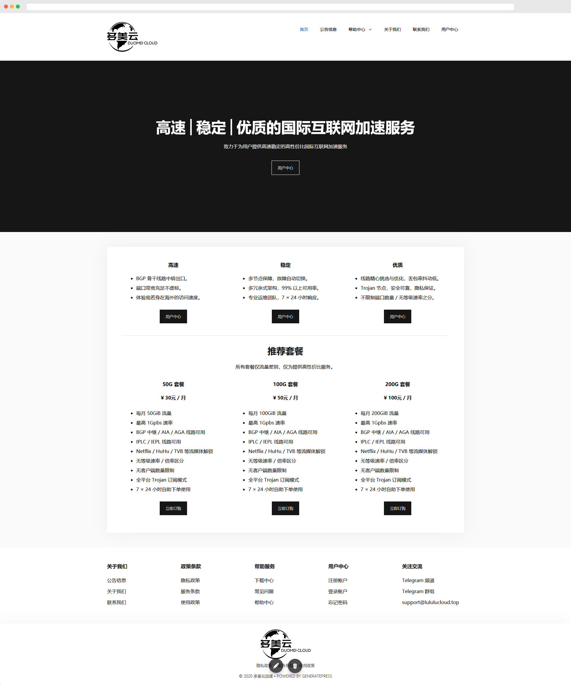

# 用户中心

您可以在这里查看我们用户中心的一些说明，帮助您更好的使用我们的服务。

> 我们推荐使用现代化的浏览器浏览我们的网站与用户中心，例如：Google Chrome、 Microsoft Edge、Mozilla Firefox、Apple Safari 等。否则可能会导致元素显示错误。

### 用户中心入口

1. 登录**「多美云加速│DuomeiCloud」**的官网：[https://lululucloud.xyz/](https://lululucloud.xyz/)。
2. 点击 **用户中心** 进入。

或直接输入用户中心网址：[https://lululucloud.top/](https://lululucloud.top/)

### 详情查看





