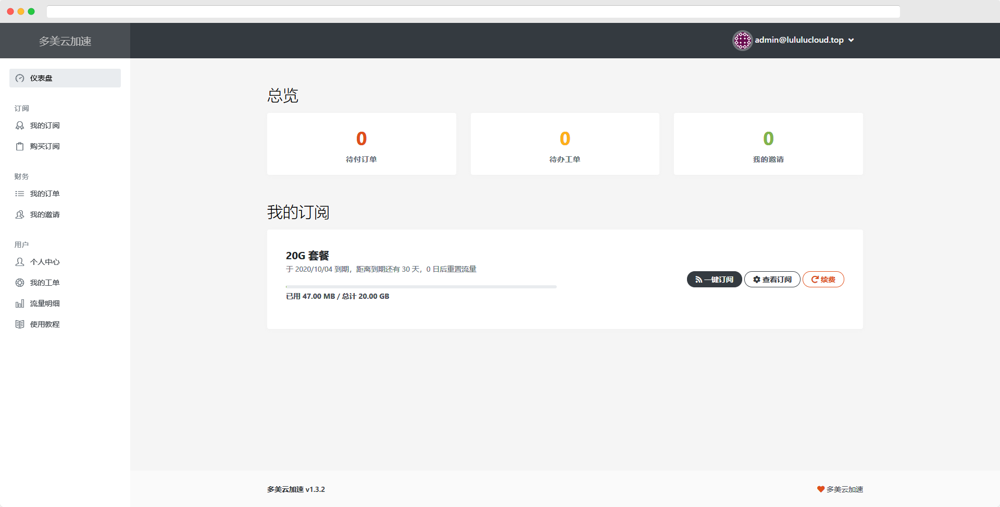
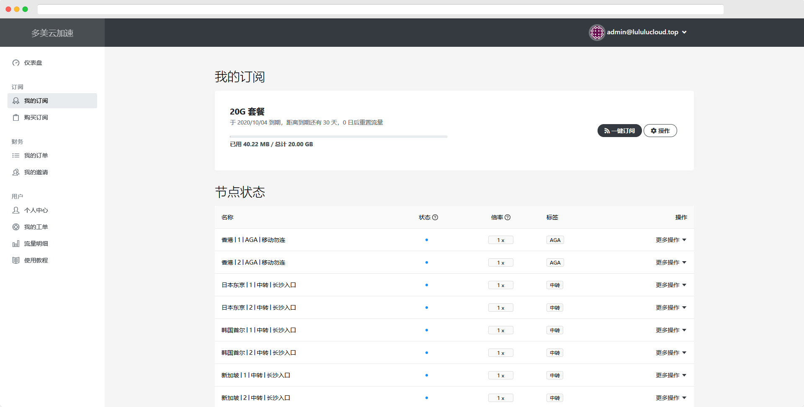
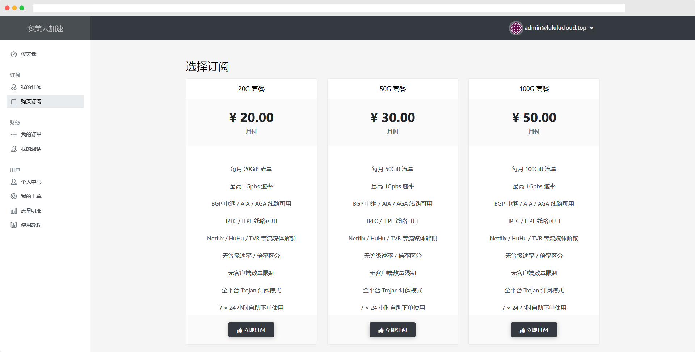
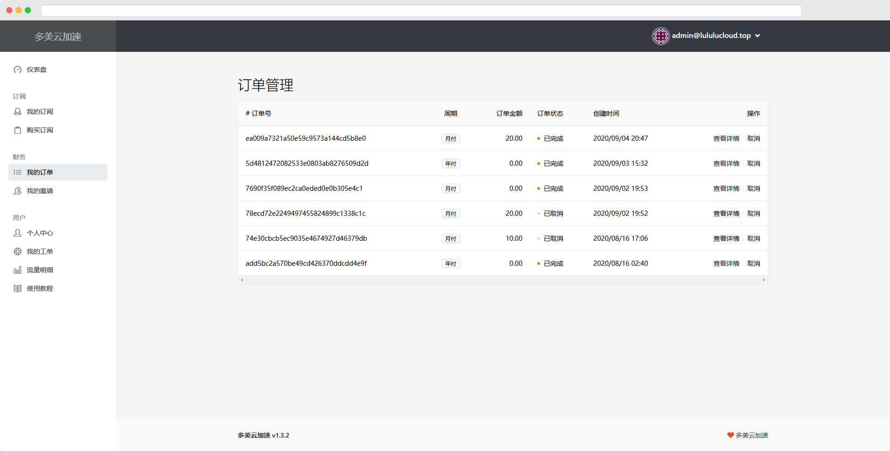
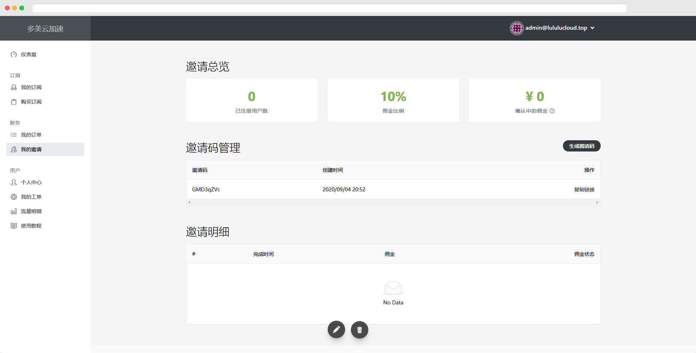
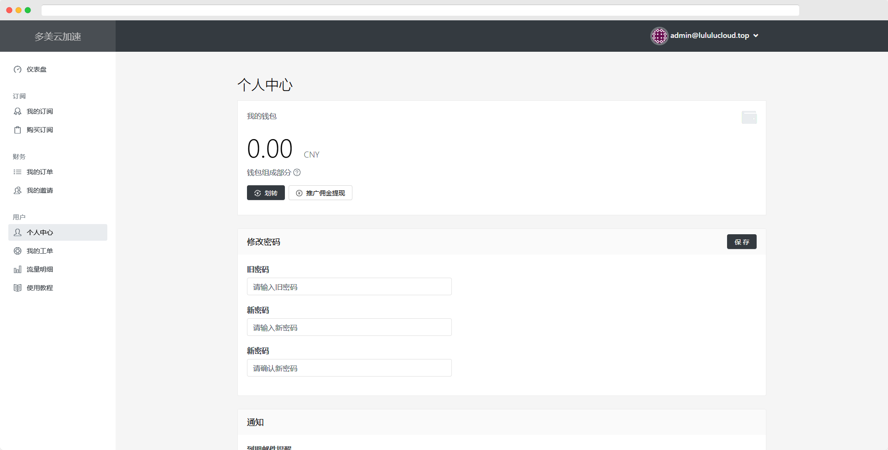
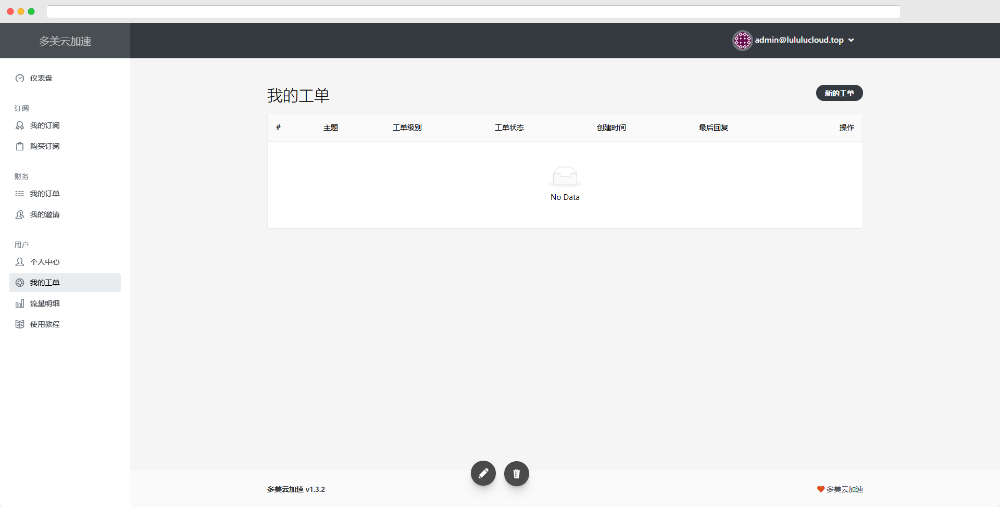
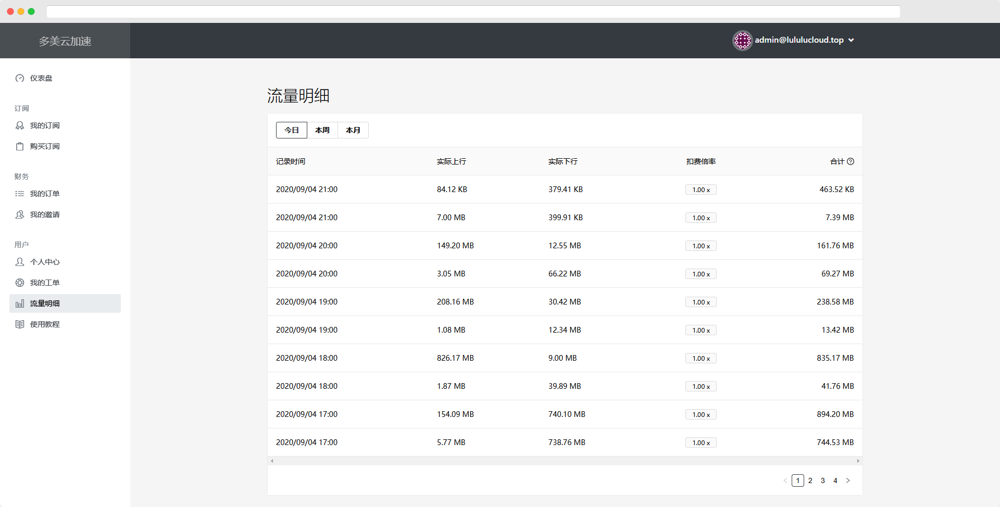
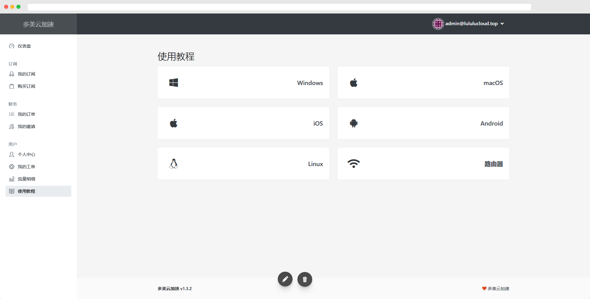

# 用户面板

## 仪表盘


仪表盘可以查看您的相关信息。


## 订阅

### 我的订阅


我的订阅内可以查看您的订阅信息与节点状态。


### 购买订阅


此处可以选择您需要的套餐进行购买，我们仅接受支付宝支付。

购买完成后，等待套餐生效，即可使用。


## 财务

### 我的订单


此处可以查看您的订单信息，包括订单的状态。


### 我的邀请


此处可以生成邀请码，用来邀请您的朋友注册订阅我们的服务，如果您的朋友通过您的邀请码注册并成功订阅，那么您可以收到相对于比例的佣金，佣金可以直接购买服务，或者满 100元可以申请提现。


## 用户

### 个人中心


此处是您的账户相关信息，您可以查看余额信息，包括进行提现操作，也可以修改密码、绑定 TG，邮箱提醒和重置自己的订阅信息。


### 我的工单


如果您对我们的服务有什么问题，或者节点有故障，可以通过此处向我们发送工单，我们看到后会及时的处理。您也可以在这里看处理的结果。


### 流量明细


您可以在此处查看自己使用的流量的详细情况。


### 使用教程


此处为简单的使用教程，如果需要详细教程应该查看本[**帮助中心**](https://docs.lululucloud.xyz/)。


