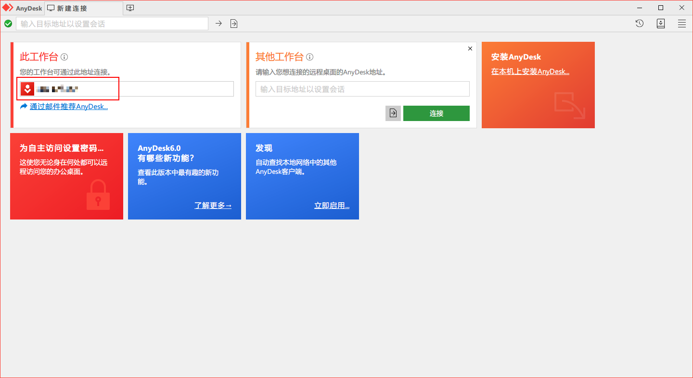
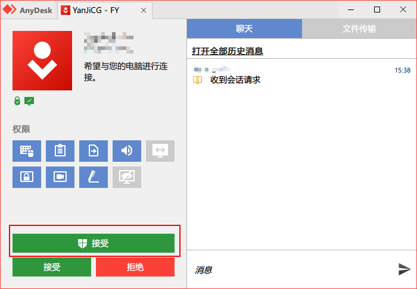

# AnyDesk

### 简介：

AnyDesk 是一款德国产个人免费的跨平台远程控制软件。

### 官网：



### 下载地址：

| 名称 | 支持系统 | 版本 | 下载链接 | 更新日期 |
| :--- | :--- | :--- | :--- | :--- |
| AnyDesk Windows 版 \( EXE \) | Windows 7+ | v6.0.8 | [官方链接](https://download.anydesk.com/AnyDesk.exe) | 2020-09-01 |
| AnyDesk Windows 版 \( MSI \) | Windows 7+ | v6.0.8 | [官方链接](https://download.anydesk.com/AnyDesk.msi) | 2020-09-01 |
| AnyDesk macOS 版 | macOS 10.10+ ×64 | v6.0.1 | [官方链接](https://download.anydesk.com/anydesk.dmg) | 2020-08-26 |
| AnyDesk Android 版 \( Google Play \) | Android 4+ | v6.0.4 | [Google Play](https://play.google.com/store/apps/details?id=com.anydesk.anydeskandroid) | 2020-07-28 |
| AnyDesk Android 版 \( APK \) | Android 4+ | v6.0.4 | [官方链接](https://download.anydesk.com/anydesk.apk) | 2020-07-28 |
| AnyDesk iOS 版 | iOS 11.0+ | v5.0.0 | [App Store](https://apps.apple.com/us/app/anydesk/id1176131273) | 2020-09-03 |
| AnyDesk Linux 版 DEB repository | Debian / Ubuntu / Mint | v6.0.1 | 官方链接 | 2020-08-25 |
| AnyDesk Linux 版 RPM repository | RHEL / CentOS / Fedora / OpenSUSE | v6.0.1 | [官方链接](http://rpm.anydesk.com/howto.html) | 2020-08-25 |
| AnyDesk Linux 版 | Debian / Ubuntu / Mint ×64 | v6.0.1 | [官方链接](https://download.anydesk.com/linux/anydesk_6.0.1-1_amd64.deb) | 2020-08-25 |
| AnyDesk Linux 版 | Debian / Ubuntu / Mint ×32 | v6.0.1 | [官方链接](https://download.anydesk.com/linux/anydesk_6.0.1-1_i386.deb) | 2020-08-25 |
| AnyDesk Linux 版 | Fedora 30 / 31/ 32 ×64 | v6.0.1 | [官方链接](https://download.anydesk.com/linux/anydesk_6.0.1-1_x86_64.rpm) | 2020-08-25 |
| AnyDesk Linux 版 | Fedora 30 / 31/ 32 ×32 | v6.0.1 | [官方链接](https://download.anydesk.com/linux/anydesk_6.0.1-1_i686.rpm) | 2020-08-25 |
| AnyDesk Linux 版 | openSUSE 15 / 42 ×64 | v6.0.1 | [官方链接](https://download.anydesk.com/linux/anydesk_6.0.1-1_x86_64.rpm) | 2020-08-25 |
| AnyDesk Linux 版 | openSUSE 15 / 42 ×32 | v6.0.1 | [官方链接](https://download.anydesk.com/linux/anydesk_6.0.1-1_i686.rpm) | 2020-08-25 |
| AnyDesk Linux 版 | CentOS 7 ×64 | v6.0.1 | [官方链接](https://download.anydesk.com/linux/anydesk-6.0.1-1.el7.x86_64.rpm) | 2020-08-25 |
| AnyDesk Linux 版 | CentOS 8 ×64 | v6.0.1 | [官方链接](https://download.anydesk.com/linux/anydesk-6.0.1-1.el8.x86_64.rpm) | 2020-08-25 |
| AnyDesk Linux 版 | RedHat Enterprise Linux 7 ×64 | v6.0.1 | [官方链接](https://download.anydesk.com/linux/anydesk-6.0.1-1.el7.x86_64.rpm) | 2020-08-25 |
| AnyDesk Linux 版 | RedHat Enterprise Linux 8 ×64 | v6.0.1 | [官方链接](https://download.anydesk.com/linux/anydesk-6.0.1-1.el8.x86_64.rpm) | 2020-08-25 |
| AnyDesk Linux 版 | Generic Linux ×64 | v6.0.1 | [官方链接](https://download.anydesk.com/linux/anydesk-6.0.1-amd64.tar.gz) | 2020-08-25 |
| AnyDesk Linux 版 | Generic Linux ×32 | v6.0.1 | [官方链接](https://download.anydesk.com/linux/anydesk-6.0.1-i386.tar.gz) | 2020-08-25 |
| AnyDesk FreeBSD 版 | FreeBSD ×64 | v6.0.1 | [官方链接](https://download.anydesk.com/freebsd/anydesk-freebsd-6.0.1-x86_64.tar.gz) | 2020-08-25 |
| AnyDesk FreeBSD 版 | FreeBSD ×32 | v6.0.1 | [官方链接](https://download.anydesk.com/freebsd/anydesk-freebsd-6.0.1-i386.tar.gz) | 2020-08-25 |
| AnyDesk Raspberry Pi 版 | Raspberry Pi | v6.0.1 | [官方链接](https://download.anydesk.com/rpi/anydesk_6.0.1-1_armhf.deb) | 2020-08-25 |
| AnyDesk Chrome OS 版 | Chrome OS | v6.0.4 | [Google Play](https://play.google.com/store/apps/details?id=com.anydesk.anydeskandroid) | 2020-07-28 |

### 使用教程：

以 Windows 平台做示范。

1. 下载对应平台并安装，打开 AnyDesk 应用。
2. 将〔此工作台〕中的地址通过复制的方式发送给我们。
3. 弹出对话框选择〔接受〕。

