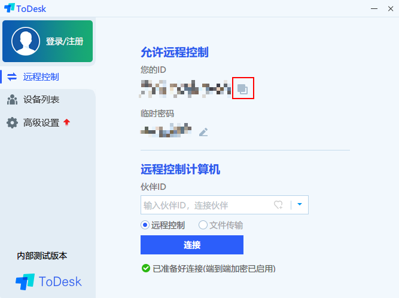
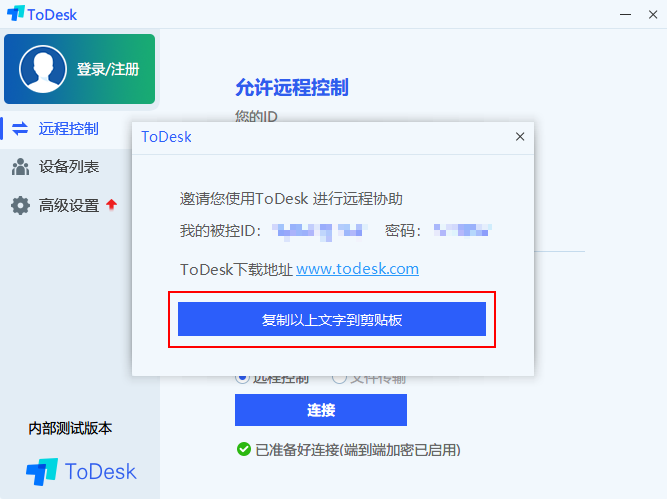

# ToDesk

### 简介：

ToDesk 是一款国产个人免费的跨平台远程控制软件。

### 官网：



### 下载地址：

| 名称 | 支持系统 | 版本 | 下载链接 |
| :--- | :--- | :--- | :--- |
| ToDesk Windows 版本 | Windows 7+ | 1.1.0828a | [官方链接](https://update.todesk.com/setup_20200828a.exe) |
| ToDesk macOS 版本 | macOS 10.10+ ×64 | 1.0.0904a | [官方链接](https://update.todesk.com/ToDesk1.0.0904a.pkg) |
| ToDesk Android 版本 | Android | 1.0.0827a | [官方链接](https://update.todesk.com/todesk.apk) |
| ToDesk iOS 版本 | iOS 9+ | 1.0.2 | [App Store](https://apps.apple.com/cn/app/todesk/id1519407428) |

### 使用教程：

以 Windows 平台做示范。

1. 下载对应平台并安装，打开 ToDesk 应用。
2. 将〔您的 ID〕与〔零时密码〕通过复制的方式发送给我们。


在远程协助过程中请您**不要离开**您的设备，谢谢配合。


